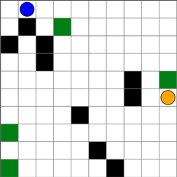

# AdversarialGridworld.jl
Defines a Gridworld MDP with two agents: the ego and the adversary. The goal of the ego agent (in blue) is to reach a reward square (in green) before the adversary (in orange) is able to overlap with the ego causing a failure.

## Usage
Construct an `AdversarialGridworldMDP` with the following arguments
* `size::Tuple{Int, Int}` - The length and width of the gridworld. Default: `(10,10)`
* `rewards::Dict{GWPos, Float64}` - The list of the locations of rewards and their values. Default: `Dict()`
* `walls::Vector{GWPos}` - The list of locations of impassable walls. Default: `[]`
* `tprob::Float64` - The probability that a transition will go according to the supplied action. Default: `0.7`
* `discount::Float64` - The discount factor of future rewards. Default: `0.95`
* `agent_gets_action` - Specification of which agetn you are controlling. Can be either `:ego` or `:adversary`. Default: `:ego`
* `ego_policy` - The policy that the ego follows when actions control the adversary. Default: `(s, rng::AbstractRNG = Random.GLOBAL_RNG) -> rand(rng, syma)`
* `adversary_policy` - The policy that the adversary follows when actions control the ego. Default: `(s, rng::AbstractRNG = Random.GLOBAL_RNG) -> rand(rng, syma)`
* `failure_penalty` - The penalty for the adversary causing a collision. Default: `5`

The file `src/task_generator.jl` contains utilities for generating variations of the gridworld that can be used for transfer learning and meta learning test cases.
